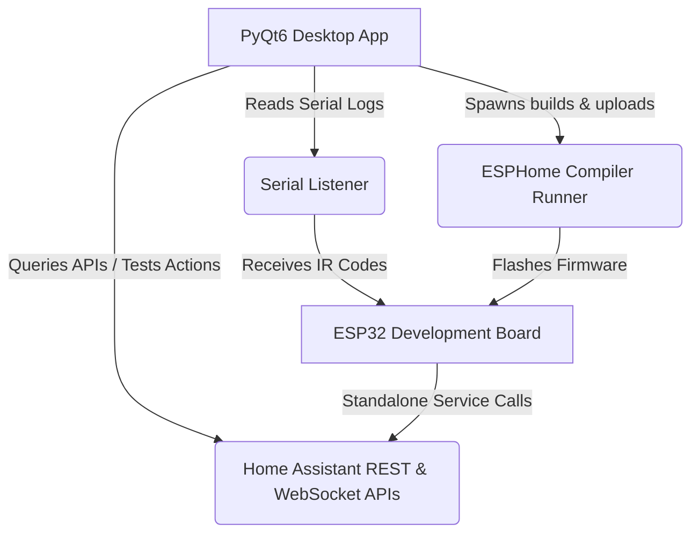

# ESPHome IR Remote Mapper

ESPHome IR Remote Mapper is a standalone desktop utility built with Python and PyQt6. It provides a graphical workflow to record infrared (IR) codes from any remote control (e.g., Switchbot Universal Remote) using an ESP32, assign those codes to Home Assistant macro actions (triggering one or multiple entities/services), and deploy a standalone ESPHome firmware directly to the ESP32.

Once configured and flashed, the ESP32 acts as a standalone device that receives the IR codes and sends service triggers directly to your Home Assistant instance over Wi-Fi, completely independent of the computer.

---

## Architecture Diagram



---

## Features

- **Direct ESP32 Interface**: Flash a temporary recorder firmware and read incoming IR codes (NEC, Samsung, Sony, LG, Panasonic, and raw Pronto formats) over Serial.
- **Dynamic Home Assistant Integration**: Enter your Home Assistant URL and Access Token to dynamically query areas, labels, categories, and controllable entities.
- **Multi-Entity and Multi-Action Mapping**: Build advanced macro commands. Assign a single remote button to toggle multiple lights, turn off media players, or activate scripts simultaneously.
- **Sensible Defaults**: The mapping wizard auto-selects common actions (e.g., `toggle`, `press`, `turn_on`) based on the selected entities' domains.
- **Timing Jitter Resilience**: Automatically applies timing tolerance (`delta: 1000`) for Pronto hex codes, ensuring reliable signal matching despite environmental IR noise or hardware fluctuations.
- **No-PC Standalone Mode**: Compile and deploy the final standalone firmware over USB. The ESP32 will communicate directly with Home Assistant over local Wi-Fi.

---

## Getting Started

### Prerequisites

1. **Python 3.8+** installed on your system.
2. An **ESP32 development board** (e.g., NodeMCU-32S, ESP32-WROOM-32D) connected to your computer via USB.
3. An **IR Receiver module** (e.g., TSOP38238) connected to a GPIO pin on your ESP32.
4. **Home Assistant** running on your local network.

### Installation

1. Clone or copy this directory:
   ```bash
   cd esphome-ir-mapper
   ```

2. Install the required Python dependencies:
   ```bash
   pip install PyQt6 pyserial requests websocket-client esphome
   ```

3. Launch the application:
   ```bash
   python app.py
   ```

---

## How to Use

### Step 1: Configurations & Settings
1. Navigate to the **Settings** tab.
2. Enter your **Home Assistant URL** (e.g., `http://192.168.1.100:8123`) and a **Long-Lived Access Token** (generated in HA under your User Profile -> Long-Lived Access Tokens).
3. Click **Test HA Connection** to verify connection.
4. Enter your local **Wi-Fi SSID** and **Wi-Fi Password** (so the final ESP32 firmware can connect to your network).
5. Choose the **ESP32 COM Port** (click "Refresh Ports" if needed), select your **Board Type**, and designate your **IR GPIO pin** (e.g., `34`) and optional status LED pin.
6. Click **Save Configurations**.

### Step 2: Capture IR Code & Assign Actions
1. Go to the **Compile & Deploy** tab and click **Flash Recorder Firmware**. This uploads a temporary logger to the ESP32.
2. Once complete, return to the **Mappings Dashboard** tab and click **Start Listening**.
3. Click **Add New Mapping Wizard**.
4. Press a button on your remote. The wizard will display a confirmation tick and show the received IR details.
5. In the **Assign Actions** pane (2-column layout):
   - **Left column**: Select one or multiple target entities and click `+ Add Entity to Mapping`.
   - **Right column**: Select your target entities and choose the actions (services) you want to trigger. Click `+ Add Selected Actions to Queue` to construct your macro list.
   - You can click **Test Selection** to verify the service call directly triggers your devices in Home Assistant in real-time.
6. Provide a descriptive name for the button (e.g., "Living Room Off Macro") and click **Save Button Mapping**.

### Step 3: Flash Final Firmware
1. Go to the **Compile & Deploy** tab.
2. Click **Compile & Flash Final Firmware**.
3. ESPHome will compile the standalone firmware and upload it.
4. In Home Assistant, go to **Settings** -> **Devices & Services** -> **ESPHome**. Find your newly discovered device card, click **Configure**, and make sure to check the box for **"Allow the device to perform Home Assistant actions"** in the options flow.
5. You can now disconnect the ESP32 from your computer. Once powered externally, it will trigger the mapped actions directly over Wi-Fi!

---

## File Structure

- `app.py`: Main PyQt6 application managing tabs, mapping wizard layouts, and events.
- `ha_client.py`: Home Assistant REST and WebSocket API client.
- `serial_listener.py`: Parses incoming serial logger outputs into structured IR timing codes.
- `esphome_runner.py`: Spawns background compile/flash subprocesses to keep the GUI responsive.
- `esphome_templates.py`: Holds standard recorder and standalone ESPHome configuration YAML structures.
